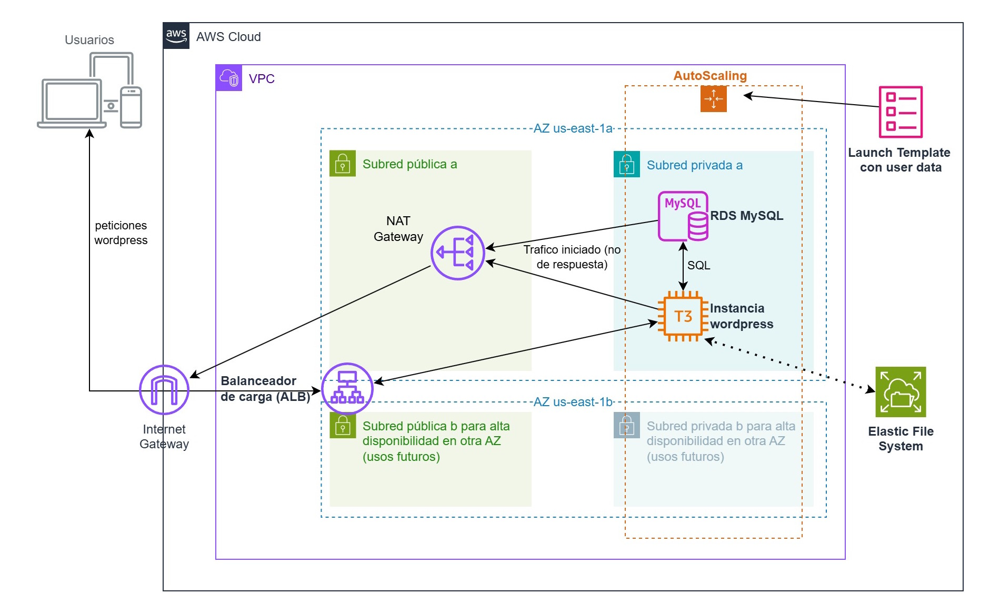
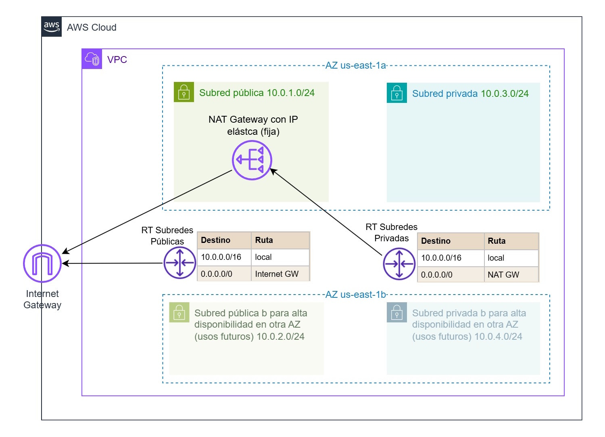
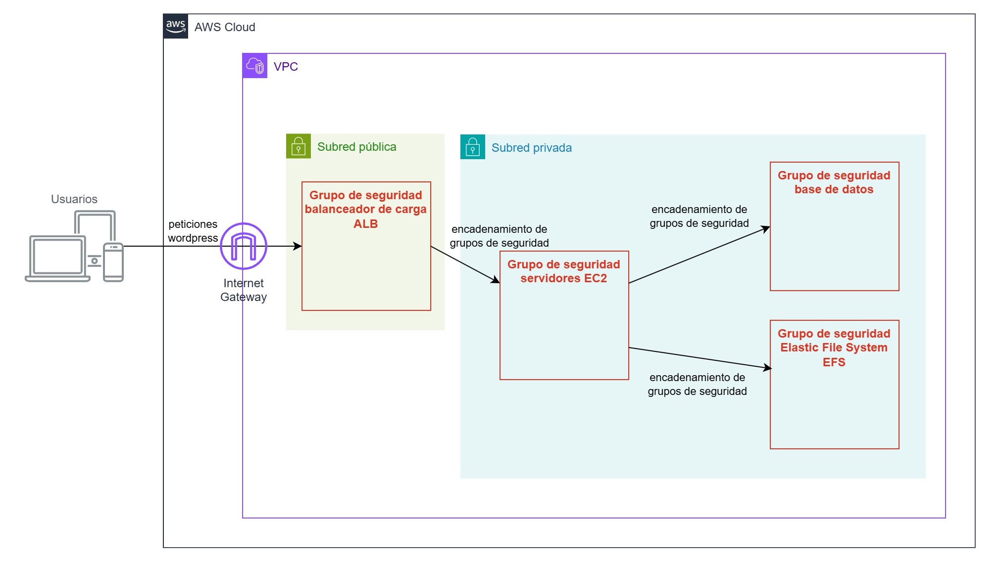

# Terraform en AWS – Infraestructura para aplicación web

En esta práctica construiremos desde cero una infraestructura en AWS usando Terraform. Desplegaremos una aplicación web (WordPress) de **alta disponibilidad** con una arquitectura de **dos niveles**: servidores web EC2 en múltiples zonas, un balanceador de carga, base de datos gestionada (Amazon RDS) y un sistema de archivos compartido (Amazon EFS) que contendrá tanto código como *assets*, entre otros elementos. A lo largo del proceso, reforzaremos conceptos claves de Terraform (proveedores, recursos, variables, estado, etc.) y de AWS (VPC, subredes, **grupos de seguridad**, **roles IAM**, autoescalado, balanceador de carga, EC2, RDS, user-data, etc.), y tareas extra para resolver.



> [!NOTE]
>  **Recuerda que estamos en AWS Academy Learner Lab:** En este entorno de laboratorio existen algunas **restricciones** importantes: no se permite crear nuevos roles IAM (usaremos **LabRole**), y *no* se pueden utilizar servicios como **CloudFront** ni **Route 53**. En algún apartado extra propondremos trasladar el proyectoa otros laboratorios y usar alguna cuenta externa con usuario limitado. Supondremos también que tienes el Terraform configurado en tu equipo o entorno Cloud9 (preferible)

## 1. Comprobar la estructura del proyecto

Empezaremos creando la estructura de archivos y directorios para nuestro proyecto Terraform.  En Cloud9, abre una nueva terminal y ejecuta:

```bash
# 1. Haz un pull del repositorio de la formación para tener los últimos cambios
(normalmente desde la interfaz de Cloud9)

# 2. Entra en la carpeta practica-terraform-aws del repositorio
cd practica-terraform-aws
```

Comprueba que ahora tienes un proyecto con esta estructura

```bash
$ tree
.
├── seguridad.tf
├── red.tf
├── aplicacion.tf
├── outputs.tf
├── providers.tf
├── variables.tf
└── userdata
    └── staging-web.sh
```

Tener archivos separados por funcionalidad ayuda a que Terraform las cargue de forma organizada y a que los cambios sean más manejables. *(Terraform carga automáticamente todos los `.tf` en el directorio, sin importar el nombre, y fusiona la configuración.)*.  Observa que en `providers.tf` definimos el **proveedor de AWS** que usaremos con versiones mínimas para evitar problemas de sintaxis. También puedes ir revisando el resto de archivos, aunque los trataremos de forma separada.

Ahora inicia el proyecto el Terraform

```bash
terraform init
```

Este comando conectará con el registro de Terraform, descargará el plugin del proveedor AWS y lo instalará en el directorio `.terraform/`. Deberías ver en la salida algo como:

```
Initializing the backend...
Initializing provider plugins...
- Finding hashicorp/aws versions matching "~> 4.0"...
- Installing hashicorp/aws v4.66.0...
- Installed hashicorp/aws v4.66.0 (signed by HashiCorp)
Terraform has been successfully initialized!
```

Ahora ya estamos listos para ir desglosando la infraestructura.

## 2. Variables de entrada (variables.tf)

Las **variables** en Terraform nos permiten hacer reusable y configurable la infraestructura, en lugar de hardcodear valores en el código. Así, aspectos como región, identificadores, tamaños, contraseñas, etc., podemos modificarlos fácilmente sin tocar la lógica principal. Observa que además definimos un prefijo de proyecto "tfaws" para que todos los recursos creados tengan esa nomenclatura.

<details>

<summary>
Pulsa para ver el contenido del fichero
</summary>

```hcl
# variables.tf
# Región de AWS donde desplegar la infraestructura (por defecto us-east-1)

variable "aws_region" {
description = "Región de AWS donde se desplegarán los recursos"
type = string
default = "us-east-1"
}

# Prefijo para nombres de recursos (por ejemplo, usar tus iniciales o proyecto)
variable "project_name" {
description = "Prefijo identificador para nombres de recursos en AWS"
type = string
default = "tfaws"
}

# VPC CIDR principal
variable "vpc_cidr" {
description = "Bloque CIDR para la VPC"
type = string
default = "10.0.0.0/16"
}

# Subredes públicas (lista de CIDR, una por zona de disponibilidad)
variable "public_subnets_cidrs" {
description = "Lista de bloques CIDR para subredes públicas"
type = list(string)
default = ["10.0.1.0/24", "10.0.2.0/24"]
}

# Subredes privadas (para base de datos/servidores privados)
variable "private_subnets_cidrs" {
description = "Lista de bloques CIDR para subredes privadas"
type = list(string)
default = ["10.0.101.0/24", "10.0.102.0/24"]
}

# Nombre de par de claves SSH existente (opcional, si se desea acceso SSH a instancia)
variable "key_name" {
description = "Nombre de la key pair de EC2 para SSH"
type = string
default = "" # dejar vacío si no se usará SSH manual
}

# Tipo de instancia EC2 para los servidores web
variable "instance_type" {
description = "Tipo de instancia EC2 para los servidores web"
type = string
default = "t3.micro"
}

# Parámetros para la base de datos (RDS MySQL)
variable "db_name" {
description = "Nombre de la base de datos de WordPress en RDS"
type = string
default = "wordpress"
}
variable "db_username" {
description = "Usuario administrador de la base de datos RDS"
type = string
default = "admin"
}
variable "db_password" {
description = "Contraseña del usuario de la base de datos RDS"
type = string
default = "PAssw0rd1234" # En entorno real, usar una contraseña segura y no hardcodeada
sensitive = true # Marcar como sensible para no mostrar en salida de Terraform
}

variable "DOMAIN_NAME" {
  type        = string
  description = "Dominio para la instalación de WordPress"
  default     = "wordpress-iac-tf.midemo.com"
}

variable "DEMO_USERNAME" {
  type        = string
  description = "Usuario administrador para WordPress"
  default     = "wpadmin"
}

variable "DEMO_PASSWORD" {
  type        = string
  description = "Contraseña administrador para WordPress"
  default     = "wppassword123"
  sensitive = true # Marcar como sensible para no mostrar en salida de Terraform
}

variable "DEMO_EMAIL" {
  type        = string
  description = "Email administrador para WordPress"
  default     = "admin@midemo.com"
}
```

</details>

Repasemos estas variables:

- **aws_region:** región AWS donde trabajaremos, limitada por el Leaner Lab. Por defecto “us-east-1”. Puedes cambiarlo a `"us-west-2"` si prefieres, pero asegúrate de usar la misma región en todos los recursos.  
- **project_name:** un identificador para tus recursos (se usará en los nombres para distinguirlos, útil en entornos compartidos o para evitar colisiones), se pueden poner sólo letras y números, no espacios.  
- **vpc_cidr:** bloque de direcciones IP para la red VPC. Usamos un /16 (`10.0.0.0/16`) típico por sencillez.  
- **public_subnets_cidrs / private_subnets_cidrs:** listas de CIDR para dos subredes públicas y dos privadas, respectivamente. Hemos elegido subredes /24 cogiendo todo el by por comodidad. Cada subred estará en una Zona de Disponibilidad distinta (usaremos dos AZs para alta disponibilidad).   
- **key_name:** nombre de una *Key Pair* de EC2 para SSH. Si deseas poder conectarte vía SSH a los servidores (por ejemplo, para depurar manualmente), debes tener creado un key pair en la región y poner aquí su nombre. Por defecto lo dejamos vacío (lo que hará que las instancias lancen sin clave SSH). En principio no tenemos que entrar a nada en las instancias, pero siempre podemos usar SSM.
- **instance_type:** tipo de instancia EC2 para los servidores web. `t3.micro` típica mejor relación calidad-precio.
- **db_name, db_username, db_password:** credenciales de la base de datos MySQL que crearemos en RDS. **En producción usarías contraseñas seguras y las manejarías de forma segura** (por ejemplo con AWS Secrets Manager), se puede hacer como extra. Marcamos la contraseña como `sensitive = true` para que Terraform no la muestre en texto plano en su salida.  
- **DOMAIN NAME, DEMO_USERNAME, DEMO_PASSWORD, DEMO_EMAIL:** credenciales para instalación de Wordpress. De nuevo en producción se deben gestionar mejor estos datos, sobre todo la password: por sencillez sólo ponemos la contraseña como `sensitive = true` como en el caso anterior

> [!NOTE]
> **Observa:** ¿Por qué parametrizar estos valores? Usando variables podemos reutilizar nuestro código Terraform en distintos entornos (dev, prod, regiones diferentes) simplemente cambiando los valores de entrada, sin duplicar código. Por ejemplo, podríamos desplegar la misma infraestructura en *us-west-2* pasando `-var="aws_region=us-west-2"` al aplicar, o aumentar el tamaño de instancias cambiando `instance_type` a un valor mayor según la carga. Las variables hacen nuestra infraestructura más **flexible y modulable**.

Ahora que las variables están definidas, Terraform reconocerá estos valores con sus defaults. Siempre podríamos sobreescribirlos utilizando un archivo `.tfvars` o la línea de comandos, de ser necesario.

## 3. Recursos IAM: Rol para la instancia (sólo teoría, no podemos crearlos)

Hemos visto que un servicio de AWS necesitará permisos para interactuar con otros servicios de AWS. Este podría ser el caso de nuestra aplicación: el servidor web en EC2 quizá en algún momento deba acceder a otros servicios para leer o escribir, y ello debe estar definido en un rol que alimente un Instance Profile. 

En nuestro caso, no hay una necesidad inmediata, pero con fines didácticos ilustramos cómo debería definirse para tener permisos de comunicación con Systems Manager (SSM) para facilitar administración, utilizando un **Rol IAM**. En un entorno normal, crearíamos ese rol IAM específico para que lo asuman las instancias EC2 al lanzarse (a través de un Instance Profile), otorgándoles permisos granulares . **Sin embargo, en nuestro entorno de laboratorio no tenemos permiso para crear roles IAM**, así que *no ejecutaremos* esta parte, pero la describiremos para completar el conocimiento.

### Definición del rol IAM (sólo teoría, no usar)

Vamos a ver cómo sería el código Terraform para un rol IAM de la instancia. De poder hacerlo, lo incluiríamos en `seguridad.tf` o bien en un nuevo archivo  `iam.tf`.

<details>

<summary>
Pulsa para ver el contenido del fichero
</summary>

```hcl
# (Ejemplo - No ejecutar en Lab)
resource "aws_iam_role" "ec2_instance_role" {
  name = "${var.project_name}-ec2-role"
  assume_role_policy = jsonencode({
    Version = "2012-10-17",
    Statement = [
      {
        Effect = "Allow",
        Principal = { Service = "ec2.amazonaws.com" },
        Action   = "sts:AssumeRole"
      }
    ]
  })
  description = "Rol IAM para EC2 que permite acceso SSM"
}

# Política gestionada de AWS para SSM (permite a la instancia usar AWS Systems Manager)
resource "aws_iam_role_policy_attachment" "ec2_ssm_attach" {
  role       = aws_iam_role.ec2_instance_role.name
  policy_arn = "arn:aws:iam::aws:policy/AmazonSSMManagedInstanceCore"
}

# Instance Profile para asociar el rol a instancias EC2
resource "aws_iam_instance_profile" "ec2_instance_profile" {
  name = "${var.project_name}-instance-profile"
  role = aws_iam_role.ec2_instance_role.name
}
```

</details>

Analicemos brevemente: 

- **aws_iam_role.ec2_instance_role:** Crea un rol IAM nombrado con el prefijo de proyecto. `assume_role_policy` es el trust policy que permite al servicio EC2 asumir este rol (principal `ec2.amazonaws.com`). Esto es imprescindible para que EC2 pueda usar el rol.  
- **aws_iam_role_policy_attachment.ec2_ssm_attach:** Adjunta la política AWS predefinida **AmazonSSMManagedInstanceCore** al rol, para que la instancia tenga permisos de SSM (por ejemplo, para usar Session Manager en lugar de SSH, enviar logs, etc.).  
- **aws_iam_instance_profile.ec2_instance_profile:** Crea un instance profile, que es la entidad asociable a EC2, alimentada por el rol.

En el laboratorio tenemos un rol LabRole y un instance profile "LabInstanceProfile" que es alimentado por ese rol, por lo que podremos usarlo al lanzar la instancia y tiene todos los permisos de que disponemos.

Con este concepto claro a nivel teórico, pasemos a la creación de los componentes de red y seguridad de la infraestructura.

## 4. Crear recursos de red (VPC, subredes, tablas de enrutamiento...)

Empezaremos describiendo la columna vertebral que es la **red**: una VPC para nuestra aplicación, con subredes y tablas de enrutamiento, Internet Gateway y NAT Gateway (que necesitará IP elástica).



### VPC e Internet Gateway

En AWS, una **VPC (Virtual Private Cloud)** es una red virtual aislada lógicamente donde podemos lanzar recursos AWS. Crearemos una VPC nueva en la región elegida, usando el CIDR especificado en `var.vpc_cidr` y le atacharemos un **Internet Gateway (IGW)** para permitir a la VPC comunicarse con Internet. 

Este código está en **`red.tf`** y no tiene mucha dificultad, se explica en los comentarios.

<details>

<summary>
Pulsa para ver el contenido del fichero
</summary>

```hcl
# Crear la VPC
resource "aws_vpc" "main_vpc" {
  cidr_block           = var.vpc_cidr
  enable_dns_hostnames = true   # habilitar DNS dentro de la VPC (necesario para resoluciones internas/SSM)
  enable_dns_support   = true
  tags = {
    Name = "${var.project_name}-vpc"
  }
}

# Internet Gateway para la VPC (permite salida a Internet)
resource "aws_internet_gateway" "igw" {
  vpc_id = aws_vpc.main_vpc.id
  tags = {
    Name = "${var.project_name}-igw"
  }
}
```

</details>

### Subredes públicas y privadas

Nuestra arquitectura requiere diferentes tipos de **subredes** dentro de la VPC: 

- **Subredes públicas:** con acceso directo a Internet (a través del IGW). Aquí se pone cualquier cosa que deba ser accesibles externamente, elementos del frontend, en nuestro caso el *balanceador de carga* (ALB) y el NAT Gateway.  
- **Subredes privadas:** sin acceso directo a Internet. Aquí pondremos recursos del backend, como las instancias de aplicación (como en nuestro caso, que sólo deben ser accesibles por el ALB) y la base de datos RDS.

Usaremos dos subredes públicas (una en cada AZ) y dos subredes privadas (una en cada AZ). Así distribuimos la infraestructura en al menos 2 zonas de disponibilidad para tolerancia a fallos. Los CIDR de estas subredes ya los definimos en nuestras variables (`public_subnets_cidrs` y `private_subnets_cidrs`). 

El código igualmente está en `red.tf` con las definiciones de subredes y tablas de enrutamiento.

<details>

<summary>
Pulsa para ver el contenido del fichero
</summary>

```hcl
# Crear subredes públicas en las dos primeras AZ de la región
resource "aws_subnet" "public" {
  count             = length(var.public_subnets_cidrs)
  vpc_id            = aws_vpc.main_vpc.id
  cidr_block        = var.public_subnets_cidrs[count.index]
  map_public_ip_on_launch = true  # asignar IP pública automáticamente a instancias en esta subred
  availability_zone = "${var.aws_region}${tolist(["a","b"])[count.index]}"
  tags = {
    Name = "${var.project_name}-public-${count.index + 1}"
  }
}

# Crear subredes privadas en las dos primeras AZ de la región
resource "aws_subnet" "private" {
  count             = length(var.private_subnets_cidrs)
  vpc_id            = aws_vpc.main_vpc.id
  cidr_block        = var.private_subnets_cidrs[count.index]
  map_public_ip_on_launch = false
  availability_zone = "${var.aws_region}${tolist(["a","b"])[count.index]}"
  tags = {
    Name = "${var.project_name}-private-${count.index + 1}"
  }
}

# Tabla de enrutamiento para subredes públicas (con ruta hacia Internet)
resource "aws_route_table" "public_rt" {
  vpc_id = aws_vpc.main_vpc.id
  route {
    cidr_block = "0.0.0.0/0"
    gateway_id = aws_internet_gateway.igw.id
  }
  tags = {
    Name = "${var.project_name}-public-rt"
  }
}

# Asociar subredes públicas a la tabla de enrutamiento pública
resource "aws_route_table_association" "public_assoc" {
  count          = length(var.public_subnets_cidrs)
  subnet_id      = aws_subnet.public[count.index].id
  route_table_id = aws_route_table.public_rt.id
}

# (Opcional) Tabla de enrutamiento privada (sin salida a internet directa)
resource "aws_route_table" "private_rt" {
  vpc_id = aws_vpc.main_vpc.id
  tags = {
    Name = "${var.project_name}-private-rt"
  }
}

# Asociar subredes privadas a la tabla de enrutamiento privada
resource "aws_route_table_association" "private_assoc" {
  count          = length(var.private_subnets_cidrs)
  subnet_id      = aws_subnet.private[count.index].id
  route_table_id = aws_route_table.private_rt.id
}
```

</details>

La creación es sencilla, pero aquí hemos usado características típicas de código Terraform, vamos a desglosar:

- **aws_subnet.public:** Creamos subredes públicas usando un `count` para no duplicar código. `count = length(var.public_subnets_cidrs)` iterará dos veces (ya que por defecto esa lista tiene dos CIDRs). Usamos `count.index` para indexar el CIDR correspondiente. Asignamos `map_public_ip_on_launch = true`, que indica que cualquier instancia lanzada aquí obtendrá automáticamente una IP pública de AWS (necesario para que puedan ser accesibles desde Internet). La `availability_zone` la definimos concatenando la región con `"a"` o `"b"` según el índice. Aquí usamos una pequeña astucia: `tolist(["a","b"])[count.index]` nos devuelve `"a"` en la primera iteración y `"b"` en la segunda. Así, si la región es us-east-1, las AZ serán *us-east-1a* y *us-east-1b*. (Puedes ajustar esto si tu región preferida tiene otras AZ disponibles). Etiquetamos cada subred con Name distinto (public-1, public-2).  

- **aws_subnet.private:** Similar al anterior, pero para subredes privadas. Aquí `map_public_ip_on_launch = false` porque **no queremos** que las instancias en subred privada reciban IP pública. La AZ se calcula igual para mantener correlación (privada-1 en misma AZ que pública-1, privada-2 en AZ de pública-2, etc.). Etiquetamos como private-1, private-2.  

- **aws_route_table.public_rt:** Creamos una tabla de enrutamiento para las subredes públicas. En ella añadimos una ruta: destino `0.0.0.0/0` (cualquier red, es decir Internet) y como *target* la Internet Gateway (`aws_internet_gateway.igw.id`). 

- **aws_route_table_association.public_assoc:** Asociamos cada subred pública a la ruta pública. De nuevo usamos `count` para iterar sobre cada subred pública creada, y para cada una, vinculamos su ID con la ID de la tabla de ruta pública. Fíjate que este acto es lo que convierte a una subred en AWS como pública: no hay ningún atributo "public" o "private", todas son privadas por defecto y dejan de serlo y pasa a ser pública sólo si se asocian a una tabla de enrutamiento que lleve 0.0.0.0/0 al Internet Gateway. 

- **aws_route_table.private_rt** y **aws_route_table_association.private_assoc:** En este caso sólo enruta tráfico local entre subredes del VPC, y lo asociamos a esas subredes privadas.

> [!NOTE]
> **Observa:** Con esta configuración, cualquier instancia en subred pública obtendrá IP pública y tendrá ruta 0.0.0.0 -> IGW, es decir, acceso saliente a Internet y posibilidad de ser accedida desde fuera (si el grupo de seguridad lo permite). En cambio, instancias en subred privada no tendrán IP pública ni ruta a IGW, por lo que no pueden salir a internet, por ejemplo para actualizar servidores o sincronizar datos. Por ello, añadimos en el diseño un **NAT Gateway** que permita a máquinas que están en subred privada *iniciar* conexiones hacia Internet, sin convertirse en públicamente accesibles.

### NAT Gateway (acceso de salida para subredes privadas)

Como hemos comentado, un **NAT Gateway** permite a instancias en subredes privadas salir a Internet usando una IP pública compartida, sin exponer directamente esas instancias. Esa IP debe ser fija, por lo que aparte del propio NAT Gateway necesitaremos dar de alta una IP elástica (así es como llama AWS a las IPs fijas). 

El código está disponible en el fichero `red.tf`.

<details>

<summary>
Pulsa para ver el contenido del fichero
</summary>

```hcl
# Elastic IP para el NAT Gateway
resource "aws_eip" "nat_eip" {
  domain     = "vpc"
  depends_on = [aws_internet_gateway.igw]
}

# NAT Gateway en la primera subred pública
resource "aws_nat_gateway" "nat" {
allocation_id = aws_eip.nat_eip.id
subnet_id = aws_subnet.public[0].id # desplegar NAT en la primera subred pública (AZ "a")
tags = {
Name = "${var.project_name}-natgw"
}
depends_on = [aws_internet_gateway.igw] # necesita IGW operativo
}

# Agregar ruta por defecto en la tabla privada apuntando al NAT (para salidaa internet desde privadas)
resource "aws_route" "private_nat_route" {
route_table_id = aws_route_table.private_rt.id
destination_cidr_block = "0.0.0.0/0"
nat_gateway_id = aws_nat_gateway.nat.id
}
```

</details>

**Detalles:** 

- **aws_eip.nat_eip:** Reserva una IP elástica para el NAT. Marcamos `vpc = true` ya que es para uso en VPC. Esto asignará una IP pública de AWS a nuestra cuenta (0,005$/h).  
- **aws_nat_gateway.nat:** Crea el NAT Gateway en la subred pública [0] (es decir, us-east-1a si seguimos con las AZ). Asociamos la EIP al NAT via `allocation_id`.   
- **aws_route.private_nat_route:** Añade en la tabla de enrutamiento de las subredes privadas una ruta por defecto 0.0.0.0/0 pero esta vez *apuntando al NAT Gateway*, permitiendo a los recursos en subred privada salir, pero sin exponerse directamente.

> [!NOTE]
> **Observa:** Para simplificar y por costes, hemos creado **un solo NAT Gateway** en AZ *us-east-1a*. Ambas subredes privadas (en AZ-a y AZ-b) usan este NAT, que aunque es una estructura altamente escalable y no es cuello de botella, si pensamos en alta disponibilidad deberíamos tener uno en cada AZ.

Opcional: puedes verificar lo que hemos visto hasta ahora, ejecutando un **plan** sin aplicar nada:

```bash
terraform plan -target=aws_vpc.main_vpc -target=aws_subnet.public -target=aws_subnet.private -target=aws_nat_gateway.nat
```

## 5. Crear recursos de seguridad (cortafuegos)

En esta arquitectura sencilla, sólo crearemos cortafuegos de entrada/salida con estado, que funcionan a nivel de interfaz de red para instancias, base de datos y balanceador de carga: los **grupos de seguridad**. En arquitecturas más detalladas, se podrían añadir elementos como *Web Application Firewalls* (*WAFs*) o *NACLS* (cortafuegos sin estado para regular el tráfico entre subredes, principalmente), pero aquí lo dejaremos sencillo, su uso realizando **encadenamiento de grupos de seguridad** es bastante robusto:

- **SG del balanceador de carga (ALB)** – Permitirá tráfico web desde Internet hacia el ALB y encadenará con el de las instancias EC2 de aplicación web.  
- **SG de los servidores web (EC2)** – Controlará el tráfico desde/hacia los servidores de la aplicación. Como punto central de la infraestructura, encadenará con el anterior, con el de la base de datos y con el del volumen EFS. 
- **SG de la base de datos (RDS)** – Al encadenar con el anterior, permitirá sólo las conexiones desde los servidores web al puerto MySQL (3306) de la base de datos.  
- **SG de EFS** – Igualmente, al encadenar con el de los servidores EC2, permitirá que sólo estos se conecten al volumen EFS (protocolo NFS, puerto 2049).  



El código está disponible en el fichero `seguridad.tf`.

<details>

<summary>
Pulsa para ver el contenido del fichero
</summary>

```hcl
# SG para el Load Balancer - permite tráfico web desde internet
resource "aws_security_group" "alb_sg" {
name = "${var.project_name}-alb-sg"
description = "Permitir HTTP desde Internet al ALB"
vpc_id = aws_vpc.main_vpc.id

# Regla de entrada: HTTP (80)  desde cualquier origen
ingress {
  description = "HTTP desde Internet"
  from_port   = 80
  to_port     = 80
  protocol    = "tcp"
  cidr_blocks = ["0.0.0.0/0"]
}

# Salida: permitir todo (regla default implícita de SG)
egress {
from_port = 0
to_port = 0
protocol = "-1"
cidr_blocks = ["0.0.0.0/0"]
description = "Allow all outbound"
}

tags = {
Name = "${var.project_name}-alb-sg"
}
}

# SG para las instancias EC2 (servidores web)
resource "aws_security_group" "web_sg" {
name = "${var.project_name}-web-sg"
description = "Permitir acceso al servidor web desde ALB"
vpc_id = aws_vpc.main_vpc.id

ingress {
description = "HTTP desde el ALB"
from_port = 80
to_port = 80
protocol = "tcp"
security_groups = [aws_security_group.alb_sg.id] # permitido desde SG del ALB
}

egress {
from_port = 0
to_port = 0
protocol = "-1"
cidr_blocks = ["0.0.0.0/0"]
description = "Allow all outbound"
}

tags = {
Name = "${var.project_name}-web-sg"
}
}

# SG para la base de datos (RDS)
resource "aws_security_group" "db_sg" {
name = "${var.project_name}-db-sg"
description = "Permitir acceso MySQL desde servidores web"
vpc_id = aws_vpc.main_vpc.id

ingress {
description = "MySQL desde Web SG"
from_port = 3306
to_port = 3306
protocol = "tcp"
security_groups = [aws_security_group.web_sg.id] # solo desde instancias con web_sg
}

egress {
from_port = 0
to_port = 0
protocol = "-1"
cidr_blocks = ["0.0.0.0/0"]
}

tags = {
Name = "${var.project_name}-db-sg"
}
}

# SG para EFS (sistema de archivos)
resource "aws_security_group" "efs_sg" {
name = "${var.project_name}-efs-sg"
description = "Permitir acceso NFS (EFS) desde servidores web"
vpc_id = aws_vpc.main_vpc.id
ingress {
description = "NFS desde Web SG"
from_port = 2049
to_port = 2049
protocol = "tcp"
security_groups = [aws_security_group.web_sg.id]
}

egress {
from_port = 0
to_port = 0
protocol = "-1"
cidr_blocks = ["0.0.0.0/0"]
}


tags = {
Name = "${var.project_name}-efs-sg"
}
}
```

</details>

Con estos grupos de seguridad, hemos implementado el *principio de mínimo privilegio*: cada componente tiene permiso sólo para lo necesario. De este modo, controlamos el flujo de tráfico entre las capas:

- Internet -> ALB (80) [permitido]  
- ALB -> Servidores Web (80) [permitido]  
- Servidores Web -> RDS (3306) [permitido]  
- Servidores Web -> EFS (2049) [permitido]  
- Cualquier otro patrón (por ejemplo Internet -> servidores web directamente, o Internet -> RDS, etc.) está *denegado*, porque no definimos reglas para ello en los SG. Hay que recordar que dado que son cortafuegos con estado, por ejemplo, si los servidores web inician una conexión hacia RDS en 3306, la respuesta de RDS a web *también* será permitida, independientemente de las reglas: no necesitamos una regla separada para el tráfico de respuesta. 

Si quieres puedes ejecutar `terraform plan` para ver el plan completo hasta ahora o  `terraform validate` para asegurarte de que la sintaxis es correcta y todas las referencias coinciden. 

## 6. Crear recursos de la aplicación (EC2, ALB, ASG, RDS, EFS)

Esta es la principal y última sección, donde completamos la arquitectura definiendo las capas de computación y almacenamiento.

- Un sistema de ficheros **EFS** para que los servidores web compartan el mismo almacenamiento (necesario para WordPress, así todos los nodos ven el mismo código, archivos subidos, plugins, etc.).  
- Una base de datos **RDS (MySQL)** para el WordPress (posts, usuarios, etc.) como servicio gestionado.  
- Un **Application Load Balancer (ALB)** para distribuir tráfico entre múltiples servidores web, con Target Groups y Listeners correspondientes.  
- Un **Auto Scaling Group** (ASG) de instancias **EC2** para los servidores web, utilizando una **Launch Template** con **user data** para instalar y configurar WordPress automáticamente en cada instancia.


Al final de este paso podremos aplicar la configuración y desplegar la infraestructura.

### Amazon EFS: sistema de archivos compartido

WordPress es una aplicación stateful: guarda archivos subidos (imágenes, etc.) en el sistema de archivos local. Si queremos que se ejecute WordPress en más de un servidor (múltiples EC2), necesitamos un almacenamiento compartido para que todos vean los mismos archivos. Amazon EFS (Elastic File System) es perfecto para esto: es un servicio gestionado de NFS, accesible por todas las instancias en la VPC, que **crece automáticamente** según lo que se necesite y admite *concurrencia múltiple de lectores y escritores* con coherencia en pocos milisegundos. Montaremos EFS en cada instancia como `/var/www/html` (raiz del servidor web Apache) para que los archivos de WordPress estén centralizados.

Debemos crear el **sistema de archivos EFS** y **puntos de montaje** (*Mount Target*) en cada subred, ubicando uno por Zona de Disponibilidad donde queramos acceder. Así, cada *Mount Target* se coloca en una subred y proporciona una IP local para que las instancias en esa AZ monten NFS como sistema de ficheros. Crearemos un *Mount Target* en cada subred privada (AZ-a y AZ-b) para que las instancias (que estarán en subredes privadas) puedan conectarse al EFS dentro de su AZ.

El código de este fragmento y anteriores está disponible en el fichero `aplicacion.tf`.

<details>

<summary>
Pulsa para ver el contenido del fichero
</summary>

```hcl
# Sistema de archivos EFS
resource "aws_efs_file_system" "wordpress_fs" {
provisioned_throughput_in_mibps = 0
throughput_mode = "bursting"
encrypted = false
tags = {
Name = "${var.project_name}-efs"
}
}

# Crear un Mount Target de EFS en cada subred privada
resource "aws_efs_mount_target" "efs_mount" {
count = length(var.private_subnets_cidrs)
file_system_id = aws_efs_file_system.wordpress_fs.id
subnet_id = aws_subnet.private[count.index].id
security_groups = [aws_security_group.efs_sg.id]
}
```

</details>

Explicación:

- **aws_efs_file_system.wordpress_fs:** Crea el sistema de archivos. Mantenemos configuración por defecto: *throughput_mode* "bursting" (modo estándar que ajusta el throughput según el tamaño de datos, suficiente para nuestra carga baja) y sin cifrado (para simplificar, aunque en producción se suele cifrar EFS). Lo etiquetamos. Este recurso nos da un ID de filesystem.  

- **aws_efs_mount_target.efs_mount:** Utilizamos `count` para crear múltiples mount targets. Por cada subred privada en nuestra lista, crearemos un punto de montaje: asociando al *file_system_id* de arriba y `subnet_id` correspondiente. Adjuntamos el cortafuegos `efs_sg` que definimos antes para que sólo se pueda acceder desde las instancias web de wordpress. AWS asignará automáticamente una dirección IP dentro de cada subred para el mount target. Nuestras instancias en la misma AZ usarán esa IP (resuelta por DNS) para montar. **Importante:** Un mount target sólo puede crearse en subredes *en las que haya al menos una ruta de red válida hacia los clientes.* En nuestro caso, las instancias web en subred privada podrán alcanzar el mount target porque están en la misma subred/AZ (rango local). No hace falta IGW ni NAT para EFS; el tráfico NFS es interno en la VPC.  

### Base de datos RDS (MySQL)

A continuación, crearemos la base de datos MySQL en Amazon RDS. RDS nos provee una instancia de base de datos gestionada: AWS se encarga de la instalación, parches, backups (si configuramos), y podemos habilitar Multi-AZ para alta disponibilidad, entre otras características. Vamos a crear una **instancia RDS MySQL** de tamaño básico (*db.t3.micro*) usando los parámetros que definimos (nombre, usuario, contraseña). La colocaremos en las subredes privadas y la haremos *no pública* (sin IP pública), ya que solo la usaremos internamente desde la VPC. Asociaremos el cortafuegos  `db_sg` para que solo los servidores web puedan conectarse. 

También necesitaremos un **DB Subnet Group** para RDS: esto es una agrupación de subredes que RDS utilizará para sus endpoints. Le pasaremos nuestras subredes privadas, de modo que RDS cree primario y standby (si desplegamos Multi-AZ) en estas subredes. Sin un subnet group explícito, RDS podría usar por defecto la VPC default, y eso no tiene sentido, queremos tener los recursos bajo control. Para alta disponibilidad automática, podríamos hacer un despliegue multi-AZ, pero de momento lo dejaremos así, aunque queda preparado para ello cuando se desee.

El código de este fragmento y anteriores está disponible en el fichero `aplicacion.tf`.

<details>

<summary>
Pulsa para ver el contenido del fichero
</summary>

```hcl
# Subnet Group para RDS (usar subredes privadas)
resource "aws_db_subnet_group" "rds_subnets" {
name = "${var.project_name}-rds-subnetgrp"
subnet_ids = aws_subnet.private[*].id
tags = {
Name = "${var.project_name}-rds-subnetgrp"
}
}

resource "aws_db_instance" "wordpress_db" {
  identifier             = "${var.project_name}-db"
  engine                 = "mysql"
  engine_version         = "8.0"
  instance_class         = "db.t3.micro"
  allocated_storage      = 20
  db_name                = var.db_name
  username               = var.db_username
  password               = var.db_password  
  db_subnet_group_name   = aws_db_subnet_group.rds_subnets.name
  vpc_security_group_ids = [aws_security_group.db_sg.id]
  publicly_accessible    = false
  skip_final_snapshot    = true
  deletion_protection    = false

  tags = {
    Name = "${var.project_name}-db"
  }
}

```

</details>

Detalle:

- **aws_db_subnet_group.rds_subnets:** Listamos las subredes privadas (`aws_subnet.private[*].id` es la sintaxis para obtener todas las IDs del recurso multi-count). RDS usará estas subnets para ubicar la instancia. 

- **aws_db_instance.wordpress_db:** Configuramos la instancia:
  - `engine = "mysql"` y `engine_version = "8.0"` para MySQL 8.0.  
  - `instance_class = "db.t3.micro"` (suficiente para el ejercicio).  
  - `allocated_storage = 20` GB de almacenamiento (mínimo estándar).  
  - `storage_encrypted = false` (en el lab podemos dejarlo sin cifrar, en entornos reales es recomendable cifrar).  
  - `name`, `username`, `password`: tomamos de nuestras variables los valores. Esto creará la base de datos inicial con ese nombre y usuario admin.  
  - `parameter_group_name = "default.mysql8.0"`: usamos el grupo de parámetros por defecto para MySQL8. No necesitamos ajustar parámetros personalizados.  
  - `db_subnet_group_name`: referenciamos el subnet group creado, para indicarle dónde desplegar.  
  - `vpc_security_group_ids`: aquí asociamos el grupo de seguridad de la DB (`db_sg`) para que solo entren tráfico de las instancias web. 
  - `multi_az = false`: de momento despliegue de instancia única.  
  - `publicly_accessible = false`: crucial, indica que **no queremos una IP pública** para la instancia RDS. Así, solo tendrá una endpoint DNS privado accesible dentro de la VPC, es una base de datos en el backend.
  - `skip_final_snapshot = true`: en producción, al borrar una DB RDS, Terraform por defecto intenta crear un *snapshot final* para no perder datos accidentalmente, pero aquí mejor lo ponemos *false* para destruir todo al terminar.  
  - Etiquetas con Name.

Cuando creemos esta instancia, tardará algunos minutos (RDS es de los recursos más lentos en aprovisionar, sobre todo por el pequeño hardware de la instancia). 

### Application Load Balancer (ALB) y Target Group

Ahora implementaremos el **balanceador de carga de aplicación (ALB)**. Este actuará como la puerta de entrada HTTP a nuestro servicio web. El ALB operará en capa 7 (nivel de aplicación) y puede hacer routing avanzado basado en HTTP. Nosotros lo usaremos en modo sencillo: distribuir equitativamente las peticiones a los servidores web (target EC2) registrados en su *Target Group*.

Crearemos un Target Group para las instancias web (usará HTTP en puerto 80, con chequeos de salud), y un Listener en el ALB para puerto 80 que apunte al TG.

El código de este fragmento y anteriores está disponible en el fichero `aplicacion.tf`.

<details>

<summary>
Pulsa para ver el contenido del fichero
</summary>

```hcl
# Load Balancer (Application LB) público
resource "aws_lb" "app_lb" {
name = "${var.project_name}-alb"
load_balancer_type = "application"
subnets = aws_subnet.public[*].id # lo coloca en las subredes públicas
security_groups = [aws_security_group.alb_sg.id]
idle_timeout = 60
enable_deletion_protection = false
tags = {
Name = "${var.project_name}-alb"
}
}

# Target Group para los servidores web
resource "aws_lb_target_group" "web_tg" {
name = "${var.project_name}-tg"
port = 80
protocol = "HTTP"
vpc_id = aws_vpc.main_vpc.id
target_type = "instance"
health_check {
path = "/"
protocol = "HTTP"
interval = 30
timeout = 5
healthy_threshold = 3
unhealthy_threshold = 3
}
tags = {
Name = "${var.project_name}-tg"
}
}

# Listener HTTP en el ALB (puerto 80 -> target group)
resource "aws_lb_listener" "alb_listener_http" {
load_balancer_arn = aws_lb.app_lb.arn
port = 80
protocol = "HTTP"
default_action {
type = "forward"
target_group_arn = aws_lb_target_group.web_tg.arn
}
}

```

</details>

Explicación:

- **aws_lb.app_lb:** Creamos el ALB público. Le pasamos las subnets públicas (`aws_subnet.public[*].id]`). ALB requiere subnets de al menos dos AZ para alta disponibilidad, y nosotros le damos las dos subredes públicas, una en cada AZ. Creará una *Network Interface* en cada una, cada una con su propia IP pública, y DNS que las rota. Asignamos el cortafuegos `alb_sg` para que solo permita 80 como definimos. `idle_timeout` 60 segundos (tiempo que ALB espera en caso de conexiones inactivas, 60 es default). Desactivamos deletion protection (si no, luego para destruir hay que desactivar manualmente).  

- **aws_lb_target_group.web_tg:** Este TG agrupará nuestros targets (instancias web). Usamos tipo "instance" (en nuestra opinión es mejor usar etiquetado, pero como tendremos un ASG no queremos complicar la práctica). Puerto 80, protocolo HTTP – es donde el ALB enviará tráfico a los instancias. Definimos un *health check*: que ALB revise la raíz de Wordpress `"/"` mediante HTTP cada 30s, con timeout 5s, y lo considere sano tras 3 respuestas buenas seguidas o enfermo tras 3 fallos. Esto permitirá al ALB detectar instancias caídas o que no respondan. (WordPress responderá con código 200 en la página principal `/` si está funcionando, lo que será usado para health check y un error 4xx o 5xx si algo va mal).  

- **aws_lb_listener.alb_listener_http:** Crea un listener en el ALB en puerto 80 HTTP. La acción por defecto es *forward* al target group `web_tg`. Es decir, cualquier petición entrante al ALB en el puerto 80 será enviada a uno de los targets registrados en el TG. (El ALB realiza *balanceo de carga* con algoritmo round-robin inteligente teniendo en cuenta peso, salud, etc.).  

Con el ALB listo, queda **registrar los targets (instancias)**. Pero eso Terraform lo hará automáticamente cuando definamos las instancias/ASG y usemos la integración con el TG. Lo haremos a continuación en la sección de EC2/ASG.

### Launch Template y Auto Scaling Group para las instancias web

Finalmente, crearemos las **instancias EC2** que ejecutarán WordPress. Queremos que como mínimo haya uno, y la posibilidad de escalar a dos o más para alta disponibilidad. Lo natural entonces es usar un **Auto Scaling Group (ASG)** para gestionar la cantidad de instancias, y una **Launch Template** para definir la configuración de las instancias que se arrancan (AMI, tipo, user data, etc.). 

**User Data:** Una parte crítica es el *user data script*. Este es un script Bash que la instancia ejecutará en su primer arranque. En él vamos a automatizar la instalación de Apache, PHP, WordPress, configuración de WordPress (wp-config.php con la base de datos), montaje de EFS. Básicamente, convertiremos una instancia Amazon Linux 2023 "virgen" en un servidor web listo con WordPress. Esto nos permite no tener que crear una AMI personalizada, usando IaC para configurar la instancia (un toque de *config management* dentro del proceso IaC).

Vamos a empezar por el código de este *user data*, para lo que aparcamos el archivo `aplicacion.tf` y nos vamos a definir el script  `userdata/staging-web.sh`.

<details>

<summary>
Pulsa para ver el contenido del fichero
</summary>

```bash
DOMAIN_NAME="${DOMAIN_NAME}"
DEMO_USERNAME="${DEMO_USERNAME}"
DEMO_PASSWORD="${DEMO_PASSWORD}"
DEMO_EMAIL="${DEMO_EMAIL}"

mkdir -p /var/www/html/
mount -t nfs4 -o nfsvers=4.1,rsize=1048576,wsize=1048576,hard,timeo=600,retrans=2,noresvport ${efs_id}.efs.${region}.amazonaws.com:/ /var/www/html/
yum install -y amazon-efs-utils
echo '${efs_id}.efs.${region}.amazonaws.com:/ /var/www/html/ efs defaults,_netdev 0 0' >> /etc/fstab

yum install -y httpd
systemctl start httpd
systemctl enable httpd
yum clean metadata
yum install -y php php-cli php-pdo php-fpm php-json php-mysqlnd php-dom

if [ ! -f /var/www/html/wp-config.php ]; then
# Si es la primera máquina, instala y configura wordpress, sino ya esta hecho
wget -O wordpress.tar.gz https://wordpress.org/wordpress-6.2.2.tar.gz
tar -xzf wordpress.tar.gz
cd wordpress
cp wp-config-sample.php wp-config.php
sed -i "s/database_name_here/${db_name}/g" wp-config.php
sed -i "s/username_here/${db_username}/g" wp-config.php
sed -i "s/password_here/${db_password}/g" wp-config.php
sed -i "s/localhost/${db_host}/g" wp-config.php
SALT=$(curl -L https://api.wordpress.org/secret-key/1.1/salt/)
STRING='soyuncopodenieveunico'
printf '%s\n' "g/$STRING/d" a "$SALT" . w | ed -s wp-config.php
cd ..
cp -r wordpress/* /var/www/html/
# WP CLI Install
wget -O wp-cli.phar https://github.com/wp-cli/wp-cli/releases/download/v2.8.1/wp-cli-2.8.1.phar
php wp-cli.phar --info
chmod +x wp-cli.phar
mv wp-cli.phar /usr/local/bin/wp
# Setup WordPress
wp --path=/var/www/html core install --allow-root \
  --url="https://${DOMAIN_NAME}" \
  --title="Terraform en AWS" \
  --admin_user="${DEMO_USERNAME}" \
  --admin_password="${DEMO_PASSWORD}" \
  --admin_email="${DEMO_EMAIL}"

fi

chown -R apache:apache /var/www/
systemctl restart httpd
```

</details>

Vamos a comentar que es lo que hace el archivo por secciones:

- **Montaje EFS:** instala utilidades NFS, monta el EFS (utilizando la variable `${efs_id}` y `${region}` de Terraform), crea el directorio `/var/www/html` y lo monta allí. Añade la entrada en `/etc/fstab` para que el montaje sea persistente entre reinicios. Con esto, cualquier archivo bajo `/var/www/html` será almacenado en EFS, y compartido entre instancias.  
- **Apache/PHP:** instala Apache (httpd) y PHP con módulos necesarios (MySQL, etc.), habilita Apache al arranque y lo inicia. Modifica la configuración para permitir `.htaccess` (WordPress usa .htaccess para URLs amigables).  

Aquí pueden pasar dos cosas: si es la **primera máquina en ser lanzada**, debe descargar y configurar el wordpress, en otro caso (de momento no habrá una segunda máquina, pero sí cuando busquemos alta disponibilidad) debe simplemente utilizar el contenido que otra máquina anterior configuró en EFS.

- Así, si no existe wp-config.php, asume que debe **descargar WordPress**, obtieniendo el Wordpress en tar.gz, lo extrae, copia los archivos a la raíz del sitio web en EFS (`/var/www/html`) y luego configura `wp-config.php`:
  - Inyecta el nombre de base de datos, usuario, contraseña con las variables Terraform `${db_name}`, `${db_username}`, `${db_password}`.
  - Reemplaza `localhost` por la dirección del host de la base de datos `${db_host}` (RDS endpoint).  
  - Obtiene **salts** de WordPress (claves únicas para autenticación) desde la API oficial y las inserta en wp-config (esto mejora la seguridad de sesiones).
- Finalmente obtiene, instala y utiliza la CLI de Wordpress para realizar una instalación desatentida con las variables declaradas en Terraform: `${DOMAIN_NAME}`, `${DEMO_USERNAME}`, `${DEMO_PASSWORD}`, `${DEMO_EMAIL}`

Ahora por último en todos los casos cambia los permisos para que Apache no tenga problemas (por ejemplo para *upload* de imágeenes) y reinicia Apache por si algo tiene que recargarse.  

El siguiente paso es crear la **Launch Template** donde referenciaremos ese archivo de `user_data` usando el archivo de script como plantilla e inyectando esos valores desde los recursos creados.

Para ello retomamos el archivo `aplicacion.tf`.

<details>

<summary>
Pulsa para ver el contenido del fichero
</summary>

```hcl
# Obtener la última AMI de Amazon Linux 2023 desde el Parameter Store de AWS
data "aws_ssm_parameter" "amzn2" {
  name = "/aws/service/ami-amazon-linux-latest/al2023-ami-kernel-default-x86_64"
}

# Launch Template para instancias web
resource "aws_launch_template" "web_lt" {
name_prefix = "${var.project_name}-lt-"
image_id = data.aws_ssm_parameter.amzn2.value
instance_type = var.instance_type
key_name = var.key_name != "" ? var.key_name : null
# Solo asignamos key pair si se proporcionó; si var.key_name es "", ponemos null (ninguna key)
vpc_security_group_ids = [aws_security_group.web_sg.id]
iam_instance_profile {
  name = "LabInstanceProfile"
}
user_data = base64encode(templatefile("${path.module}/userdata/staging-web.sh", {
  efs_id        = aws_efs_file_system.wordpress_fs.id
  region        = var.aws_region
  db_name       = var.db_name
  db_username   = var.db_username
  db_password   = var.db_password
  db_host       = aws_db_instance.wordpress_db.address
  DOMAIN_NAME   = var.DOMAIN_NAME
  DEMO_USERNAME = var.DEMO_USERNAME
  DEMO_PASSWORD = var.DEMO_PASSWORD
  DEMO_EMAIL    = var.DEMO_EMAIL
}))
tag_specifications {
resource_type = "instance"
tags = {
Name = "${var.project_name}-web"
}
}
}

# Auto Scaling Group para las instancias web
resource "aws_autoscaling_group" "web_asg" {
name_prefix = "${var.project_name}-asg-"
launch_template {
id = aws_launch_template.web_lt.id
version = "$Latest"
}
vpc_zone_identifier = aws_subnet.private[*].id
target_group_arns = [aws_lb_target_group.web_tg.arn]
desired_capacity = 1

min_size = 1
max_size = 2
health_check_type = "EC2"
health_check_grace_period = 90
tag {
key = "Name"
value = "${var.project_name}-web"
propagate_at_launch = true
}
}
```

</details>

Desglosemos:

- **data.aws_ssm_parameter.amzn2:** Usa AWS Systems Manager Parameter Store para obtener el ID de la última AMI de Amazon Linux 2023. Utilizamos el parámetro público `"/aws/service/ami-amazon-linux-latest/al2023-ami-kernel-default-x86_64"`, que siempre apunta a la AMI más reciente de AL2 en la región. De esta forma, no necesitamos hardcodear un ami-id que pudiera quedar obsoleto. 

- **aws_launch_template.web_lt:** Define la plantilla de lanzamiento:
  - `image_id` viene del data SSM (por ejemplo, en us-east-1 al momento de escribir, será algo tipo ami-0abcdef12345).  
  - `instance_type` de variable Terraform (t3.micro).  
  - `key_name` usa una expresión ternaria para solo asignar si `var.key_name` no es vacío, de lo contrario null. (Terraform requiere null en lugar de "" para omitir el campo). Esto significa: si al lanzar la infraestructura se le ha especificado un key pair, lo usará, si no, las instancias se lanzan sin posibilidad de acceso por SSH para administrar, excepto via SSM, que consideramos plenamente seguro y el estándar a usar.  
  - `vpc_security_group_ids` asigna el grupo de seguridad de la instancia web, que está encadenado al ALB y sólo permite que éste le envíe tráfico de entrada como vimos.  
  - `iam_instance_profile.name = "LabInstanceProfile"` adjunta el Instance Profile con el rol LabRole. Esto permitirá que dentro de la instancia el CLI de AWS y otros SDK usen las credenciales del LabRole.
  - `user_data`: Aquí utilizamos el contenido de nuestro script. Terraform requiere que `user_data` sea pasado como *base64*. Por eso usamos `base64encode(...)`. Dentro hacemos `templatefile("userdata/staging-web.sh", {...})` proporcionando un mapa de variables:
    - `efs_id` = id del EFS creado (lo usarán las instancias para armar la dirección de montaje `${efs_id}.efs.${region}.amazonaws.com`).  
    - `region` = la región (para lo mismo en la URL EFS).  
    - `db_name`, `db_username`, `db_password` de las variables (podríamos también usar directamente var en script, pero preferí pasarlas para consistencia).  
    - `db_host` = la dirección del RDS (propiedad `address` da el endpoint DNS). Este es crucial: las instancias pondrán ese host en wp-config para conectarse a MySQL.  
    Todas estas referencias. En producción se puede optar por usar AWS Secrets Manager en el user data, pero vamos a dejarlo así por sencillez.  

  - `tag_specifications` con resource_type "instance" nos permite poner la etiqueta *Name* automáticamente a las instancias creadas por ASG. Con ASG es necesario usar propagación de tags o bien Launch Template tags para que las instancias tengan *Name*, aquí lo hacemos de la segunda forma. No es que sea imprescindible pero queda mejor. 

- **aws_autoscaling_group.web_asg:** Configura el grupo de escalado:
  - `launch_template`: referencia la id del Launch Template y la última versión de despliegue (`$Latest`) para lanzar las instancias web.  
  - `vpc_zone_identifier`: pasamos las subnets privadas (todas). Esto indica en qué subnets (y por tanto AZs) puede lanzar instancias el ASG. Recuerda que en esta infraestructura los servidores no deben tener IP pública, sólo estará expuesto el ALB.  
  - `target_group_arns`: muy importante, enlaza el ASG con el Target Group del ALB. Esto hace que cada instancia lanzada sea automáticamente registrada en el TG (y al destruir, desregistrada). Así el ALB sabe qué instancias (sus IDs) recibirán tráfico. También es útil -marginalmente, pero nos sirve- para que el ASG espere que instancias estén *healthy* en el TG antes de marcarlas disponibles.  
  - `desired_capacity = 1`: arrancaremos con 1 instancia, para alta disponibilidad deberían ser dos.  
  - `min_size = 1`, `max_size = 2`: permitiremos escalar hasta 2 instancias, aunque en realidad para ello deberíamos provocar un evento de escalado una vez desplegada la infraestructura.
  - `health_check_type = "EC2"` y `health_check_grace_period = 90`: El ASG marcará instancia *unhealthy* si se apaga o bloquea. Hemos puesto "EC2", aunque podríamos usar "ELB" ya que tenemos ALB y TG, pero dejamos EC2 por simplicidad. El *Grace period* será de 90 segundos para dar tiempo a que la instancia se configure (recuerda que el *user data* hace un montón de cosas).  
  - **tag** block: Esto define etiquetas que el ASG propagará a instancias en el lanzamiento, y como es normal tendrán el nombre hilo conductor del ejercicio especificado en las variables de Terraform. Ponemos `propagate_at_launch = true` aunque en el fondo no es necesario para que las instancias reciban este nombre propagado, dado que ya lo hicimos en la Launch Template en *tag_specifications*, pero tenerlo duplicado no suele molestar y así vemos las dos formas.

En cuanto Terraform crea el ASG, éste se da cuenta de que no hay ninguna instancia y rápidamente pondrá en marcha una que es el mínimo. Todo el rato irá monitorizando el TG y si una instancia se vuelve *unhealthy* en ALB (opción *"ELB" health type*) o la instancia se apaga, el ASG lanzaría una de sustitución. Por simplicidad no incluimos *escalado automático* por métricas en este ejercicio de momento.

**¡Llegamos al final!** Hemos definido todos los recursos: red, seguridad, servidores, almacenamiento, base de datos, balanceador, autoescalado... Antes de proceder, es recomendable ejecutar `terraform plan` para revisar que no haya errores y ver el resumen de cambios:

```bash
terraform plan
```

La salida será extensa, incluyendo alrededor de 30 recursos a crear. Comprueba que:
- Que no haya errores de sintaxis o referencias rotas (la salida de *plan* debe terminar con *"Plan: xxx to add, 0 to change, 0 to destroy"*).
- Revisa que en `aws_db_instance.wordpress_db` aparezca `password = (sensitive value)` y no en texto claro, para confirmar sensitive está funcionando en el plan output.
- Verifica que en `aws_launch_template.web_lt` aparece user_data como una larga cadena base64 (no se mostrará su contenido decodificado en el plan).
- Que `aws_autoscaling_group.web_asg` indique correctamente 1 desired, subnets correctas, etc.


## 7. Lanzar la creación de la infraestructura y probar la aplicación Wordpress

Antes de lanzar la infraestructura, es interesante crear un archivo de *outputs*, que añadiremos al archivo `outputs.tf` y que nos proporcionarán *IDs* de elementos clave creados, bien para nuestra visualización o bien para pasar como parámetro a otros *scripts* de Terraform que pudiéramos ejecutar a posteriori:

```hcl
output "alb_dns_name" {
description = "DNS público del Application Load Balancer"
value = aws_lb.app_lb.dns_name
}
output "wordpress_url" {
description = "URL para acceder a la aplicación WordPress"
value = "http://${aws_lb.app_lb.dns_name}"
}
output "rds_endpoint" {
description = "Endpoint (DNS) de la base de datos RDS"
value = aws_db_instance.wordpress_db.address
}
```


Ahora ejecutaremos **`terraform apply`** para crear todo en AWS, el proceso durará varios minutos, sobre todo por RDS y la instancia que debe configurarse:

```bash
terraform apply
```

Terraform no esperará a que la instancia termine su user data, pero sí esperará a que se registre en el Target Group y pase el health check del ALB porque ASG está asociado al TG y esperará a que esté *healthy*. Cuando pase un rato desde que la instancia se crea, os animamos a que le deis a "Connect" a la instancia desde la consola web y os conectéis mediante SSM para ver los logs de *cloud-init* en */var/log* (`/var/log/cloud-init.log` y `/var/log/user-data.log`) donde se puede ver la ejecución detallada (y mecanismo de depuración en vuestros despliegues) del *user data*.

Finalmente, Terraform deberá mostrar algo como:

```
Apply complete! Resources: x added, 0 changed, 0 destroyed.

Outputs:
alb_dns_name = "tfaws-alb-123456.us-east-1.elb.amazonaws.com"
wordpress_url = "http://tfaws-alb-123456.us-east-1.elb.amazonaws.com"
rds_endpoint = "tfaws-db.xxxxxx.us-east-1.rds.amazonaws.com"
```

Puedes ir al URL para ver funcionando el wordpress y también puedes verificar ahora todo o parte de la infraetructura creada en la consola web de AWS, siempre con los nombres basados en "tfaws":

- VPC -> ver la VPC creada, subredes, tablas de enrutamiento, un Internet Gateway atachado y un NAT gateway visible en us-east-1a.
- EC2 -> Instances: debería haber un servidor web en estado *running* en subred privada.
- EC2 -> Security Groups: debería haber cuatro grupos de seguridad con reglas definidas. 
- EC2 -> Load Balancers: debería haber un ALB (internet-facing) con estado *active*. Si entras dentro y vas a la pestaña *Resource Map* sale una útil infografía que llega hasta las instancias a través del Target Group y el ASG.
- RDS -> Databases: deberíamos tener una instancia arrancada, en subred privada en estado *available*.
- EFS -> File Systems: deberíamos tener un volumen con dos puntos de montaje, uno en cada subred privada / AZ.

## 8. Observar estado de Terraform

Nuestro estado (`terraform.tfstate`) ahora contiene información sobre todos los recursos creados (IDs, atributos). Este archivo es local en Cloud9 a menos que configuremos *remote state*. **El estado es crucial para que Terraform entienda qué existe y pueda gestionar cambios.**

Si examinas el archivo de estado verás un JSON grande que desarrolla cada recurso creado con gran detalle de atributos. **No compartas este archivo nunca**, contiene información sensible: por ejemplo la password de la base de datos password aparece codificada pero reversible en base64 internamente, y *user data* tiene credenciales. 

*Si alguien borra o corrompe tu terraform.tfstate*, Terraform "olvidaría" qué hay: podría llevar a recrear recursos que ya existen o perder rastro de ellos, generando incoherencia. Por eso es buena práctica almacenar el estado en forma remota y segura (por ejemplo, en un bucket S3 con restricciones de acceso), especialmente al trabajar en equipos de desarrollo. Aquí no lo hemos hecho por simplicidad.

En la misma línea, podemos usar comandos Terraform para consultar la infraestructura. Por ejemplo:

- `terraform show` mostrará una salida legible del estado (parecido al plan, enumerando recursos y sus propiedades actuales).
- `terraform state list` listará todos los recursos conocidos.
- `terraform state show aws_db_instance.wordpress_db` mostrará detalles específicos de ese recurso concreto. 

## 9. Limpieza: destruir la infraestructura

Al terminar el ejercicio y sus extras, es importante **eliminar los recursos** para no seguir consumiendo créditos, ten en cuenta que aunque a las 4 horas las máquinas RDS se paran, el ALB y **sobre todo la instancia RDS no, seguirá consumiendo**. 

Terraform hace fácil la destrucción de todo lo que hemos creado, con `terraform destroy`: este comando lee el estado y genera un plan inverso: destrucción de cada recurso en el orden correcto, respetando dependencias (por ejemplo, desmontar otros recursos primero y dejar destrucción de VPC para el final). 

Vamos a destruir todo ahora:

```bash
terraform destroy
```

Una vez completado, Terraform indicará algo como "Destroy complete! Resources: xxx destroyed." 


